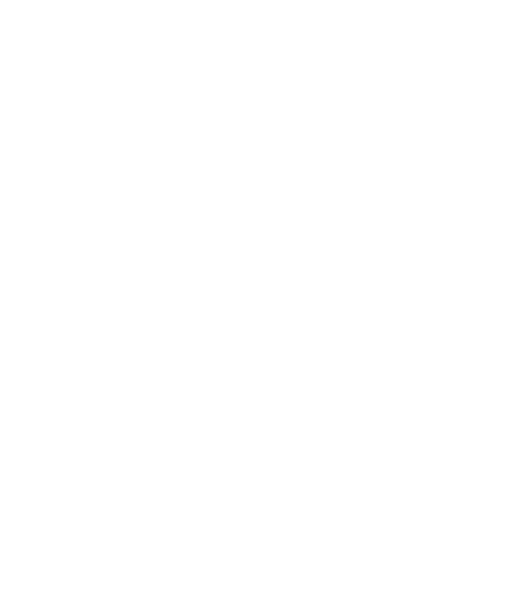

# LAPEQ — Laboratório de Pesquisa em Química Ambiental e de Biocombustíveis

<p align="center">
  
</p>

<p align="center">
  <strong>Portal institucional do Laboratório de Pesquisa em Química Ambiental e de Biocombustíveis</strong><br>
  Universidade Federal do Tocantins (UFT) — Câmpus Palmas · Unidade Embrapii
</p>

<p align="center">
  
  
  
  
  
</p>

---

## 📌 Sobre o Projeto

O **LAPEQ** (criado em 2016) é sediado no curso de **Engenharia Ambiental** da **Universidade Federal do Tocantins (UFT)** no Câmpus de Palmas e integra a **Unidade Embrapii de Bioindústria e Bioinsumos da UFT**. O laboratório atua em pesquisa científica, extensão universitária e prestação de serviços analíticos de alta complexidade para os setores agropecuário, industrial e ambiental no estado do Tocantins e na Região Norte.

Este repositório contém o código-fonte do portal web institucional do LAPEQ, desenvolvido com **FastAPI**, renderização server-side via **Jinja2 Templates** e interface moderna construída com **Tailwind CSS v4** e **daisyUI v5**.

### 🎨 Recursos de UX e Interface

- **Design System Customizado**: Paleta oficial com tons extraídos da identidade visual do laboratório (`--color-ink`, escala `brand-50` a `brand-900`).
- **Navegação Sticky com Scrollspy**: Header dinâmico com efeito de desfoque/sombra ao rolar e detecção de seção ativa via `IntersectionObserver`.
- **Menu Mobile Responsivo**: Gaveta animada com suporte a controle por atributos ARIA.
- **Botão Voltar ao Topo**: Botão flutuante suave com exibição condicionada ao scroll da página.
- **Tipografia**: Família *Montserrat* carregada via Google Fonts.
- **Ícones SVG Otimizados**: Sistema modular de ícones sem bibliotecas externas pesadas (`templates/_icons.html`).

---

## 🛠️ Tecnologias Utilizadas

| Camada | Tecnologia | Descrição |
|---|---|---|
| **Backend** | [FastAPI](https://fastapi.tiangolo.com/) | Framework web Python assíncrono de alto desempenho |
| **Templates** | [Jinja2](https://jinja.palletsprojects.com/) | Motor de templates para renderização do HTML no servidor |
| **Servidor ASGI** | [Uvicorn](https://www.uvicorn.org/) | Servidor ASGI ultrarrápido para execução do FastAPI |
| **Estilos** | [Tailwind CSS v4](https://tailwindcss.com/) | Framework CSS utility-first com novo engine `@tailwindcss/cli` |
| **Componentes UI** | [daisyUI v5](https://daisyui.com/) | Componentes e utilitários de interface com tema personalizado |
| **Frontend Scripts** | JavaScript (Vanilla) | Scripts nativos sem dependências adicionais (IntersectionObserver, Dialog API) |

---

## 📁 Estrutura do Projeto

```text
lapeq-site/
├── assets/
│   └── css/
│       └── main.css             # Arquivo fonte do Tailwind CSS e configuração de tema
├── static/
│   ├── css/
│   │   └── style.css            # CSS compilado e minificado gerado pelo Tailwind
│   ├── img/
│   │   ├── equipe/              # Fotos dos membros do laboratório
│   │   ├── logo-lapeq.jpg       # Logo favicon/institucional
│   │   ├── logo-lapeq-branco.png# Logo LAPEQ em versão branca
│   │   ├── logo-uft.png         # Logo institucional UFT
│   │   └── lab*.jpg             # Fotografias do laboratório e equipamentos
│   └── js/
│       └── main.js              # Interações de UI (menu, scrollspy, lightbox, contato)
├── templates/
│   ├── _icons.html              # Macros para renderização de ícones SVG
│   ├── _macros.html             # Componentes reutilizáveis (page_hero, section_header, cta_band)
│   ├── base.html                # Layout base com header, navegação e rodapé
│   ├── index.html               # Página inicial (Hero, Sobre, Atuação, Infraestrutura, Parceiros)
│   ├── servicos.html            # Página de serviços analíticos e escopo técnico
│   ├── equipe.html              # Página com abas da equipe (Coordenação, Técnicos, Pós, PIBIC, Estágio)
│   ├── social.html              # Página de projetos de extensão e aparições na mídia
│   └── contato.html             # Página de contato com mapa e formulário
├── .gitignore                   # Arquivos e pastas ignorados no versionamento Git
├── main.py                      # Aplicação FastAPI, rotas e injeção de contexto global
├── package.json                 # Dependências Node.js (Tailwind CSS v4, daisyUI)
├── requirements.txt             # Dependências Python (FastAPI, Uvicorn, Jinja2, etc.)
└── README.md                    # Documentação do projeto
```

---

## 💻 Instalação e Execução Local

### Pré-requisitos
- **Python 3.10+** instalado
- **Node.js 18+** e **npm** instalados
- **Git** instalado

---

### Passo a Passo

#### 1. Clonar o repositório
```bash
git clone https://github.com/SEU-USUARIO/lapeq-site.git
cd lapeq-site
```

#### 2. Configurar o ambiente virtual Python

- **Linux / macOS:**
  ```bash
  python3 -m venv .venv
  source .venv/bin/activate
  ```

- **Windows (PowerShell):**
  ```powershell
  python -m venv .venv
  .venv\Scripts\Activate.ps1
  ```

#### 3. Instalar as dependências Python
```bash
pip install --upgrade pip
pip install -r requirements.txt
```

#### 4. Instalar as dependências de estilo (Tailwind / daisyUI)
```bash
npm install
```

#### 5. Compilar o CSS

- **Modo Desenvolvimento (watch para alterações contínuas):**
  ```bash
  npm run dev
  ```

- **Ou compilação única minificada para produção:**
  ```bash
  npm run build
  ```

#### 6. Executar o servidor FastAPI

Com o ambiente virtual ativado:

- **Via FastAPI CLI (recomendado):**
  ```bash
  fastapi dev main.py
  ```

- **Ou via Uvicorn diretamente:**
  ```bash
  uvicorn main:app --reload --host 127.0.0.1 --port 8000
  ```

## 📄 Licença

Este projeto é desenvolvido para fins institucionais da **Universidade Federal do Tocantins (UFT)**.
Todos os direitos reservados aos autores e ao LAPEQ/UFT.
